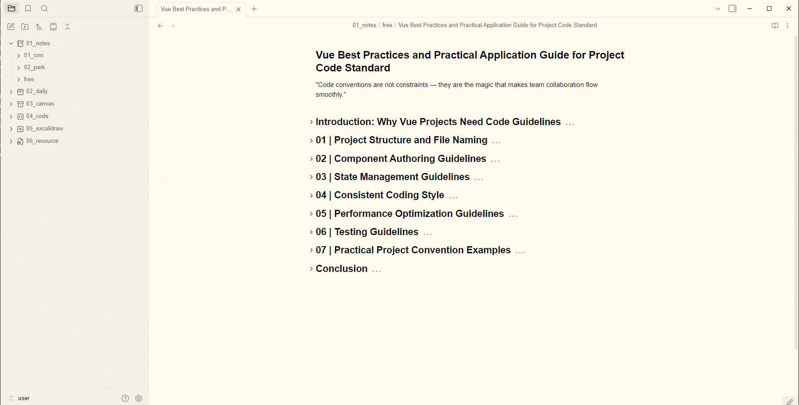

# Sunflex

Sunflex is an Obsidian theme that adapts the Sunflex color scheme to Obsidian's native CSS variables, so it can be used as a standalone theme. It builds on top of the Minimal theme interface layer.

> [中文说明](README.zh-CN.md)

## Screenshots

## Features

- Based on the Sunflex color scheme for comfortable reading and writing
- Supports both Light and Dark modes
- Includes a true-black dark variant (enabled with the `minimal-dark-black` or `black` class)
- Full 8-color semantic palette: red, orange, yellow, green, cyan, blue, purple, pink

## Installation

### From the community themes browser (recommended)

1. Open Obsidian → **Settings** → **Appearance**
2. Click **Manage** next to "Themes"
3. Search for **Sunflex** and click **Install**
4. Go back to **Appearance** and select **Sunflex** from the theme dropdown

### Manual installation

1. Copy the entire `Sunflex` folder (containing `manifest.json`, `theme.css`, and `README.md`) into your vault's `.obsidian/themes/` directory
2. Restart Obsidian
3. Open **Settings** → **Appearance** → **Themes** and select **Sunflex**

## Usage

After installing, switch between Light and Dark from **Settings** → **Appearance** → **Base color scheme**. For deeper customization install the **Style Settings** plugin (see below).

## Customization (Style Settings)

This theme is fully compatible with the [Style Settings](https://github.com/mgmeyers/obsidian-style-settings) plugin, which exposes a granular UI for tweaking colors, fonts, and features without editing CSS.

### Enabling Style Settings

1. Install the **Style Settings** community plugin
2. Enable it in **Settings** → **Community plugins**
3. Open **Settings** → **Style Settings** → **Minimal** section

### Available options

The Style Settings panel for this theme includes the following groups:

| Group | Description |
| --- | --- |
| **Interface colors** | Base hue/saturation/lightness, plus primary, secondary, and active backgrounds (`bg1`, `bg2`, `bg3`), and border colors (`ui1`, `ui2`, `ui3`) |
| **Accent color** | Primary (`ax1`), hover (`ax2`), interactive (`ax3`) accent colors, and text-on-accent (`sp1`) |
| **Extended colors** | Eight semantic colors (red, orange, yellow, green, cyan, blue, purple, pink) used for progress bars, syntax highlighting, colorful headings, and graph nodes |
| **Components** | Toggles for blockquotes, callouts (outlined), checkboxes (square shape, strikethrough), code scrolling, embeds (strict/underline/hide title), and tables |
| **Typography** | Heading size/weight/variant, body font, and various UI font sizes |
| **Layout** | Readable line width, max width, and focus mode |
| **Color schemes** | Preset schemes — Gruvbox, macOS, Nord, Notion, Rosé Pine, Sky, Solarized, Things, and true-black — selectable for light and dark |

Each setting exposes separate light and dark values so your two modes stay independent. Colors can be pasted as hex (`#rrggbb`) or HSL tuples.

## Color variables

The theme defines the following base variables on `body`:

| Variable | Description |
| --- | --- |
| `--base-h` | Base hue |
| `--base-s` | Base saturation |
| `--base-l` | Base lightness (100 = white) |
| `--accent-h` | Accent hue |
| `--accent-s` | Accent saturation |
| `--accent-l` | Accent lightness |

Light and Dark modes override these variables in `.theme-light` and `.theme-dark`, and provide a complete `--color-base-*` and `--color-*` semantic color scale.

## Recommended plugins

For the best experience, the following community plugins are supported:

- **Minimal Theme Settings** — hotkeys, fonts, and color scheme presets
- **Style Settings** — granular color and layout customization
- **Hider** — hide UI elements for a distraction-free view

## License

MIT License

Copyright (c) 2023 Sunflex
